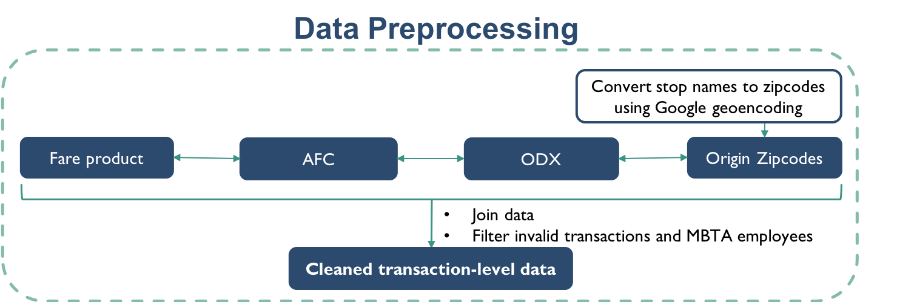
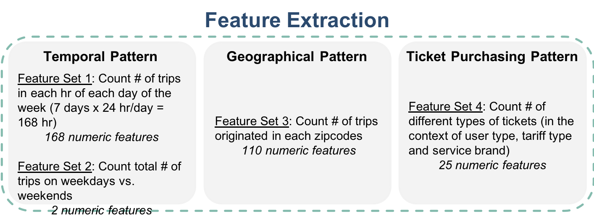
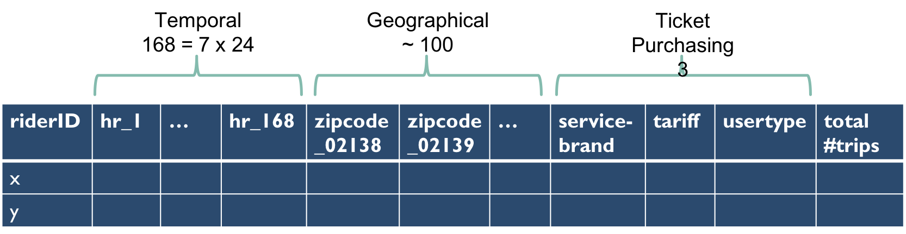

## Contents
{:.no_toc}
*  
{: toc}

## Data Preprocessing

### Data sources

Recall that we have the following resources to process data:

- **MBTA Automated Fare Collection (AFC):** monthly transaction-level data from November 2016 to November 2017, each file is about 2GB, containing over 20,000,000 records.
- **MBTA Fare product** data containing fare product definitions
- **MIT/MBTA ODX** data containing transaction-level origin/destination inference from November 2016 to November 2017
- **MBTA Stops** data containing information about a total of around 9000 stations/stops.
- **GoogleMap Geoencoding API**, which maps longitude and latitude coordinates to zip codes
- **US Census** data containing demographics information by zip codes
- **MBTA sales** data containing sales channel and card affiliations (We did not use this because it was not hashed the same way as other data sources, so we could not the match records.)

### Data Preprocessing Procedure

According to Figure 1, we first extracted the transaction records by joining relevant fields (e.g., transaction time, amount, ticket type and etc.) of from the MBTA Automated Fare Collection (AFC) table and the MBTA Fare product table. Each transaction is then joined by the ODX table to incorporate transaction origin station, which is further converted to Longitude and Latitude of that station using Google geoencoding API. We filtered out the invalid transactions that shows as having the same transaction time but negated amount.

| |
|:--:|
| ***Figure 1: Data Preprocessing*** |

## Feature Extraction

The preprocessed data as described above is grouped by riderID to extract rider-level pattern-of-use records. The rider-level features contain 3 parts, temporal pattern, geographical pattern and ticket-purchasing habits, as in Figure 2, 3.

| |
|:--:|
| ***Figure 2: Feature Extraction*** |

| |
|:--:|
| ***Figure 3: Features*** |

### Temporal Patterns
#### Feature Set 1: 168 version
Grouping transaction records by riderID, we counted the number of trips of each rider in each hour of each day of in a week-long time frame, which results in a 7 (day) by 24 (hr/day) temporal matrix. The 2D matrix is flattened to a set of 168 numeric features. We expect the temporal patterns to most intuitively represent each rider's pattern-of-use.

#### Feature Set 2: 48 version

| |
|:--:|
| ***Figure 4: Feature Collapsing*** |

In hope of reducing dimensions without losing much information, we divided the 7 by 24 hour matrix into weekday versus weekend and each then can be reduced to a 1 by 24 vector by taking average by day, producing a set of 48 numeric features（See Figure 4). Doing so, we got  got rid of a total of 120 features. The segmentation results based on this reduced feature set gave similar results compared to the original 168-length feature set.

Note: We didn't use the 48-length feature set for this project as we obtained similar results without significantly reduced time. But since the reduced feature set is more compact than the original one, we suspect that it might produce more interpretable clusters with a larger training dataset.

### Geographical patterns

Grouping transaction records by riderID, we counted the number of trips of each rider taking a trip at each zip code. This gives a total of around 100 numeric features that can represent each rider's geographical pattern-of-use. The zip code of each rider's most frequent trip origin could be approximately inferred as the rider's home location.

### Ticket Purchasing Pattern

Grouping transaction records by riderID, we counted the number of different service-brands, tariff (e.g., 7-day pass, monthly pass, Pay-as-you-go) and user-type associated with the riderID. This gives a total of 3 numeric features that can represent each rider's ticket-purchasing habits.
