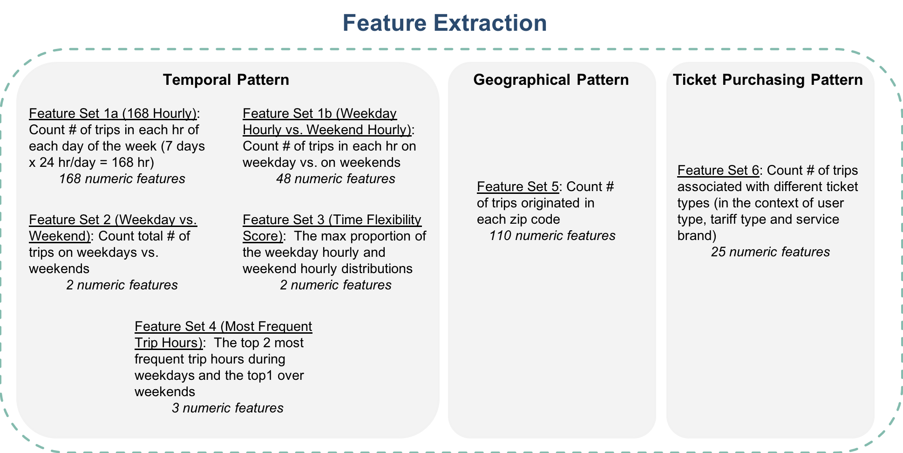

## Contents
{:.no_toc}
*  
{: toc}

## Data Preprocessing

### Data sources

Recall that we have the following data sources to process:

- **MBTA Automated Fare Collection (AFC):** monthly transaction-level data from November 2016 to November 2017, each file is about 2GB, containing over 20,000,000 records.
- **MBTA Fare product** data containing fare product definitions
- **MIT/MBTA ODX** data containing transaction-level origin/destination inference from November 2016 to November 2017
- **MBTA Stops** data containing information about a total of around 9000 stations/stops.
- **GoogleMap Geoencoding API**, which maps longitude and latitude coordinates to zip codes
- **US Census** data containing demographics information by zip codes
- **MBTA sales** data containing sales channel and card affiliations (We did not use this because it was not hashed the same way as other data sources, so we could not the match records.)

### Data Preprocessing Procedure

Our overall data prepcressing procedure is summarized in Figure 1. Briefly, we first converted station latitude and longitude to zip codes using Google Map Geoencoding API. We then joined the relevant fields from each data source according to Figure 2. Finally, we filtered out the invalid transactions, movement types, device class IDs as well as records that appear to be from MBTA employees and records that lack an origin. The end of this process is a large data frame where each row is a transaction. 

| |
|:--:|
| ***Figure 1: Data Preprocessing*** |

| |
|:--:|
| ***Figure 2: Fields Used and Strategy to Join Data Sources*** |

**Note on using the ODX data**: We only used the origin field as it is the most reliable and consistently predicted/collected field. We did not use the inferred destinations and other related fields such as predicted trip duration because there were inconsistent number of missing predictions per rider. Incorporating these fields would result in having to drop inconsistent number of records (those with missing predictions) across riders, thereby causing bias. 

**Note on filtering out invalid data**: Below is a general description of how we filtered out invalid data. For details, please consult our [Code Documentation](https://ac297r-mbta-2018.github.io/Code-Documentation/).

- For *invalid transactions*: We wrote a Python script to detect transactions that have the same transaction time but negated amount
- For *movement type*: We kept only validation_movementtype = [7, 20]
- For *device class ID*: We kept only station_deviceclassid = [411, 412, 441, 442, 443, 501, 503]
- For *filtering MBTA employees*: **SUMMARIZE HERE!**

## Feature Extraction

After the preprocessed transaction-level data is grouped by rider ID, we extracted severl sets of rider-level pattern-of-use features, with which we made 2 feature collections (combintaions of different feature sets). 

The feature sets we extracted are summarized in Figure 3. We defined 3 general categories of usage patterns (i.e. temporal, geographical and ticket purchasing). Since our client had expressed most interest in understanding and clustering riders based on when they ride, we focused our efforts on dissecting the temporal patterns from several different angles. 

| |
|:--:|
| ***Figure 3: Feature Extraction*** |

### Temporal Patterns
#### Feature Set 1a: 168 Hourly version
Grouping transaction records by riderID, we counted the number of trips of each rider in each hour of each day of in a week-long time frame, which results in a 7 (day) by 24 (hr/day) temporal matrix. The 2D matrix is flattened to a set of 168 numeric features. We expect the temporal patterns to most intuitively represent each rider's pattern-of-use.

#### Feature Set 1b: 48 (Weekday Hourly vs. Weekend Hourly) version

In hope of reducing dimensions without losing too much information, we divided the 7 by 24 hour matrix into weekday versus weekend and each then can be reduced to a 1 by 24 vector by taking average by day, producing a set of 48 numeric features（See Figure 4). Doing so, we got rid of a total of 120 features. The segmentation results based on this reduced feature set gave similar results compared to the original 168-length feature set.

| |
|:--:|
| ***Figure 4: Feature Collapsing*** |

Note: We didn't use the 48-length feature set for this project as we obtained similar results without significantly reducing computation time. But since the reduced feature set is more compact than the original one, we suspect that it might produce more interpretable clusters with a larger training dataset.

#### Feature Set 2: Time Flexibility Score

#### Feature Set 3: Weekday vs. Weekend Total Counts

### Geographical patterns

Grouping transaction records by riderID, we counted the number of trips of each rider taking a trip at each zip code. This gives a total of around 100 numeric features that can represent each rider's geographical pattern-of-use. The zip code of each rider's most frequent trip origin could be approximately inferred as the rider's home location.

### Ticket Purchasing Pattern

Grouping transaction records by riderID, we counted the number of different service-brands, tariff (e.g., 7-day pass, monthly pass, Pay-as-you-go) and user-type associated with the riderID. This gives a total of 25 numeric features that can represent each rider's ticket-purchasing habits.

### Feature Collections 

Two combinations of features sets were made for comparison.

- Feature collection 1: Feature sets 1a, 2, 3, 4, and 5

    | |
    |:--:|
    | ***Figure 5: Feature Details for Feature Collection 1*** |

- Feature collection 2: Feature sets 1b, 2, 3, 4, and 5

    | |
    |:--:|
    | ***Figure 5: Feature Details for Feature Collection 1*** |

