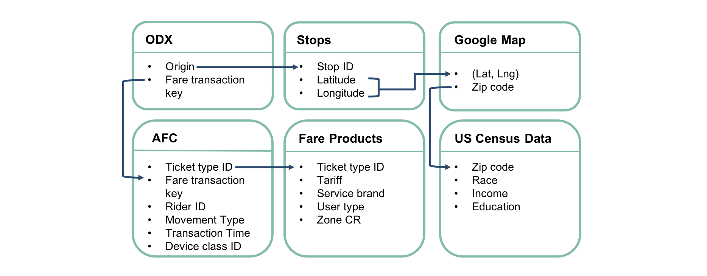

## Contents
{:.no_toc}
*  
{: toc}

## Team
Harvard 2018 Spring AC297r Capstone Project: Chia Chi (Michelle) Ho, Yijun Shen, Jiawen Tong, Anthony Hou

## Motivation & Problem Statement  

The Massachusetts Bay Transportation Authority (MBTA) is the largest public transportation agency in New England, delivering a complex system of subway, bus, commuter rail, light rail, and ferry services to riders in the dynamic economy of the Greater Boston Area. It is estimated that MBTA provides over 1.3 million trips on an average weekday. 
	While MBTA collects a wealth of trip transaction data on a daily basis, a persistent limitation has been the organization’s lack of knowledge around rider groups and their respective ridership habits. Understanding rider segmentation in the context of pattern-of-use has significant implications in developing new policies to improve its service planning and potentially changing its fare structure. Therefore, we aim to develop a flexible, repeatable rider segmentation model on MBTA’s “core system” (encompassing local buses and subway) that can group individuals according to pattern-of-use dimensions. 

## Project Deliverables

Our project deliverables are:

- A reusable Python segmentation package that clusters riders and infers rider group characteristics.
- A web-based visualization exploration tool intended to facilitate the discovery of business and ridership insights.

| | 
|:--:| 
| ***Figure 1: Project Deliverables*** |

The specific goals of each project deliverables are 
- For the Python segmentation package:
    - Develop a method to extract rider-level pattern-of-use features from transaction data
    - Develop a method to cluster riders using unsupervised learning algorithms based on extracted features
    - Develop a method to profiles rider clusters using demographic information
    - Develop a generative model that automatically generates simple reports describing rider clusters
    - Implement simple static visualization functions to display various rider segment characteristics

- For the visualization exploration tool:
    - Implement a fully dynamic web-based application with a Flask backend to display interactive D3 visualizations for data exploration (App with full functionality, not deployed to the web)
    - Implement a static version of the full app that displays the same interactive D3 visualizations without a Flask backend (App with limited functionality, deployed using Github pages)

## Data Description

Available data: 

- MBTA Automated Fare Collection (AFC) data containing transaction-level data
- MBTA Fare product data containing fare product definitions
- MIT/MBTA ODX data containing transaction-level origin/destination inference
- MBTA Stops data containing information about each station/stop
- GoogleMap Geoencoding API, which maps longitude and latitude coordinates to zip codes 
- US Census data containing demographics information by zip codes

SAY STH ABOUT WHAT WE USED AND WHY WE DIDN'T USE ODX DESTINATION

| | 
|:--:| 
| ***Figure 2: Data Structure*** |

## Literature Review

1. Case Study in France: (*Mahrsi et al. (2014). Understanding Passenger Patterns in Public Transit Through Smart Card and Socioeconomic Data. UrbComp.*)
    
    In this paper, the authors presented an approach to mine passenger temporal behaviors in order to extract interpretable rider clusters. Briefly, each rider is represented as a vector of 168 features, where each feature is the number of trips the passenger took in a certain hour of a cerain day of week (24 hours/day x 7 days a week = 168 hours/week). Using a mixture of unigram model where the number of cluster K estimated by an EM algorithm, they obtained a set of 16 temporal clusters, each describing a temporal mobility pattern. Such patterns include typical home-to-work commuter pattern, different morning peak times, and different travel behaviors on weekends. To infer cluster socioeconomic characteristics, the authors used Hidden Random Markov Field and the inferred residential stations of each passenger to extract socioeconomic clusters. Based on this socioeconomic clustering of the residential neighborhoods, the authors found that the temporal clusters also differed in their inferred socioeconomic distribution.

2. Case Study in London: (*Langlois et al. (2015). Inferring patterns in the multi-week activity sequences of public transport users. Transportation Research Part C.*）

    In this study, the authors investigate passenger heterogeneity based on a longitudinal representation of each user’s multi-week activity sequence derived from smart card data. Then they identified clusters of users with similar activity sequence structure. The application reveals 11 clusters, each characterized by a distinct sequence structure. Combined with demographic attributes including passenger age, occupation, household composition and income, and vehicle ownership from a small sample of users, the analysis reveals that significant connections exist between the demographic attributes of users and activity patterns identified exclusively from fare transactions.

## Modeling Approach Overview
Our overall modeling approach is summarized in Figure 3.

| | 
|:--:| 
| ***Figure 3: Modeling Approach Overview.** The approach is presented in the context of the overall structure of our project deliverables. Elements belonging to the Python segmentation pacakge and visualization exploration tool are colored in dark blue and light blue-green, respectively.* |

## Sample Results
- Compare hierarchical vs. non-hierarchical
- Compare lda vs. kmeans

## Conclusions

## Future Work
