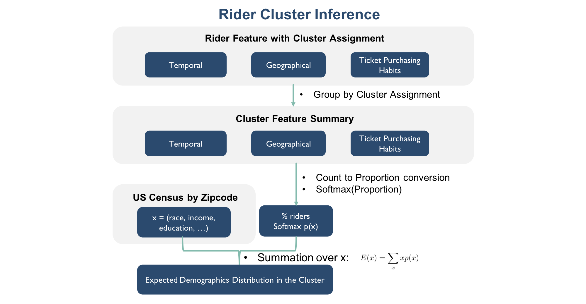
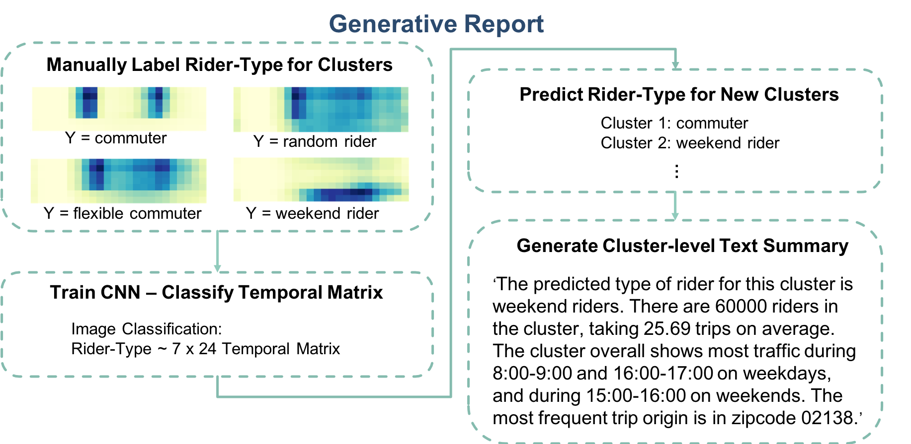

## Contents
{:.no_toc}
*
{: toc}

## Inference Overall Workflow
| |
|:--:|
| ***Figure 1: Rider Cluster Inference*** |

## Cluster Pattern-of-use
To get cluster pattern-of-use summary, we summed the rider features grouped by cluster assignments, which gives one aggregated cluster usage pattern (temporal, geographical and ticket-purchasing) summary for each cluster. The aggregated cluster usage patterns show the total traffic distribution over time, starting at geographical locations (represented as different zip codes) and associated with different types of tickets.

## Cluster Demographics Distribution
To further understand the rider clusters, we incorporated US census data to infer differences in demographics distributions. We converted geographical trip count features associated with each zip code into proportion and took a softmax transformation. This transformed softmax proportion recovers a squashed categorical distribution of trips by zip code, which is then used to map the zip code index of the US census data to ultimately produce the expected demographics distribution across clusters.

## Automatically Generated Cluster Summary

| |
|:--:|
| ***Figure 2: Generative Report*** |

To facilitate business insight development, we also developed an auto report generator based on convolutional neural network (CNN) that summarizes each cluster's pattern-of-use in the form of a short text paragraph. The CNN model is trained to identify the following 7 types of riders manually labelled by observing the 7 by 24 time matrix of each cluster. We oversampled each training data point for 500 times by adding a Gaussian noise (mean = 0, std = 0.2) signal to the original time matrix for better generalization performance.

- **7 Pre-defined Rider-Types**
> - random riders
> - weekend riders
> - less flexible commuters with normal commute hours
> - less flexible commuters with early commute hours
> - more flexible commuters with normal commute hours
> - more flexible commuters with early commute hours
> - weekend riders who also ride over weekdays

The automatically generated summary text includes the predicted rider-type based on the output of the fitted CNN model and reports the cluster size, average number of trips, the weekday / weekend hours and the zip code that show most traffic.

## Summary Findings
We were able to verify that the found clusters indeed differ in their usage patterns as well as their inferred demographics distributions.
