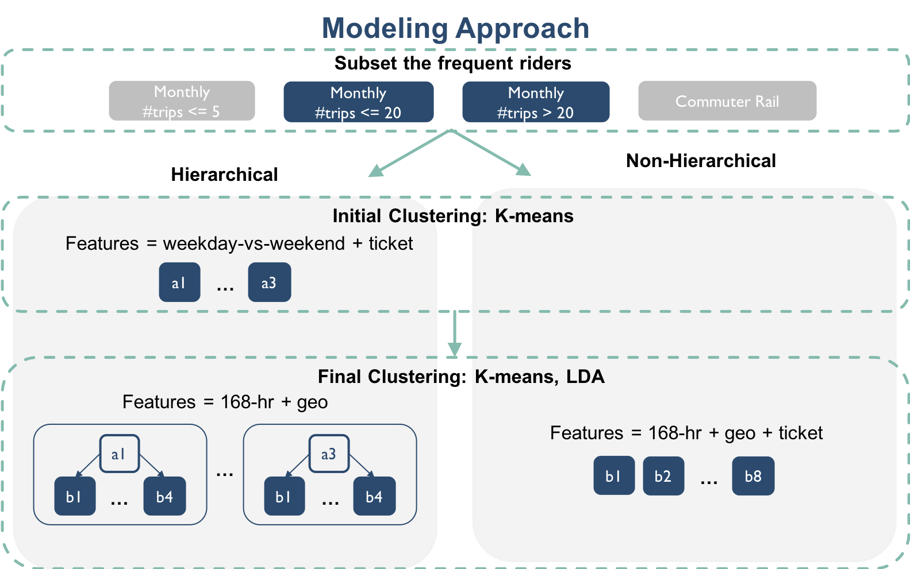

## Contents
{:.no_toc}
*  
{: toc}

## Segmentation Algorithms
We use 2 unsupervised clustering algorithms,  [Latent Dirichlet Allocation (LDA)](https://en.wikipedia.org/wiki/Latent_Dirichlet_allocation) and [K-means](https://en.wikipedia.org/wiki/K-means_clustering). Referring to scikit-learn's documentation,
[LDA](http://scikit-learn.org/stable/modules/generated/sklearn.decomposition.LatentDirichletAllocation.html) learns a mixture distribution of K topics (K is set as a priori) from a set of documents, where a document in our case represent an individual rider and a topic represents a rider-type (e.g., more/less flexible commuter, weekend rider, random rider and etc.). With LDA, each rider is modeled as a distribution of probabilities for being in each rider-type. [K-means](http://scikit-learn.org/stable/modules/generated/sklearn.cluster.KMeans.html), by contrast, does not model a rider as a full distribution of rider-types, instead it directly partitions all the riders into K types. We found that using LDA with the hierarchical pipeline (described below) is more time-efficient and produces clusters with better size stability and more interesting subtle differences than K-means. K-means tends to pick up small rider segments that have very distinct usage patterns. We suspect this to be caused by the linear boundary of K-means that partitions the outlier rider group into an individual cluster.

## Clustering Pipeline

| |
|:--:|
| ***Figure 1: Segmentation Modeling Pipeline*** |

For the general clustering procedure (Figure 1), we applied a hierarchical version and a non-hierarchical version.

In the **hierarchical** pipeline, we first used K-means to cluster based on “higher-level” usage patterns, i.e. the total number of trips taken over weekends versus during weekdays and ticket purchasing patterns; the resulting clusters are then clustered again using either algorithm based on more specific features i.e. usage in individual hours during the week and usage in each zip code. In the **non-hierarchical** pipeline, the riders are directly clustered based on the 168-hour temporal, geographical and ticket purchasing patterns. As the hierarchical structure enforces sub-clusters within initial clusters, we were able to obtain more segments with more subtle differences.
